# ORM Benchmarks

Comprehensive performance benchmarks comparing popular Python ORMs across PostgreSQL, MySQL, and SQLite.

**Tested ORMs:**

| ORM | Type | PostgreSQL | MySQL | SQLite |
|-----|------|:---:|:---:|:---:|
| [Tortoise ORM](https://github.com/tortoise/tortoise-orm) | async | asyncpg | asyncmy | aiosqlite |
| [Django](https://www.djangoproject.com/) | sync | psycopg2 | mysqlclient | sqlite3 |
| [peewee](https://github.com/coleifer/peewee) | sync | psycopg2 | pymysql | sqlite3 |
| [SQLAlchemy ORM (async)](http://www.sqlalchemy.org/) | async | asyncpg | aiomysql | aiosqlite |
| [SQLObject](https://github.com/sqlobject/sqlobject) | sync | psycopg2 | mysqlclient | sqlite3 |
| [Piccolo](https://github.com/piccolo-orm/piccolo) | async | asyncpg | — | aiosqlite |
| [ormar](https://github.com/collerek/ormar) | async | asyncpg | aiomysql | aiosqlite |

> **Environment:** Python 3.14, macOS (Apple Silicon), 100 iterations per operation.
> Piccolo does not support MySQL.

## Operations

| Code | Operation | Description |
|------|-----------|-------------|
| A | Insert: Single | Insert one row at a time |
| B | Insert: Batch | Insert many rows in a single transaction |
| C | Insert: Bulk | Use bulk insert operations |
| D | Filter: Large | Fetch a large result set |
| E | Filter: Small | Fetch limit 20 with random offset |
| F | Get | Fetch a single row by primary key |
| G | Filter: dict | Fetch large result set as dicts |
| H | Filter: tuple | Fetch large result set as tuples |
| I | Update: Whole | Update all fields of a row |
| J | Update: Partial | Update a single field |
| K | Delete | Delete a single row |

## Test Models

**Test 1 — Simple model** (4 fields): `id`, `timestamp`, `level` (indexed), `text` (indexed)

**Test 2 — FK relations**: Same as Test 1, plus self-referential foreign key, reverse FK, and M2M relation

**Test 3 — Wide model** (32+ fields): Same as Test 1, plus 4 sets of 8 typed columns (float, smallint, int, bigint, char, text, decimal, json) — 2 with defaults, 2 nullable

---

## Results: PostgreSQL 17

PostgreSQL 17 in Docker. Driver: `asyncpg` for async ORMs, `psycopg2` for sync ORMs.

### Overview

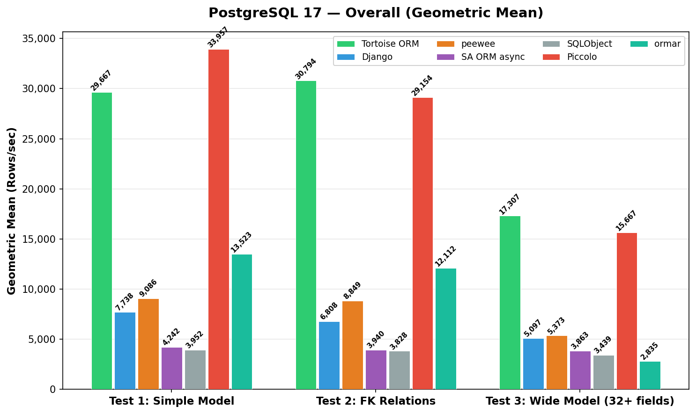

### Test 1: Simple Model (4 fields)

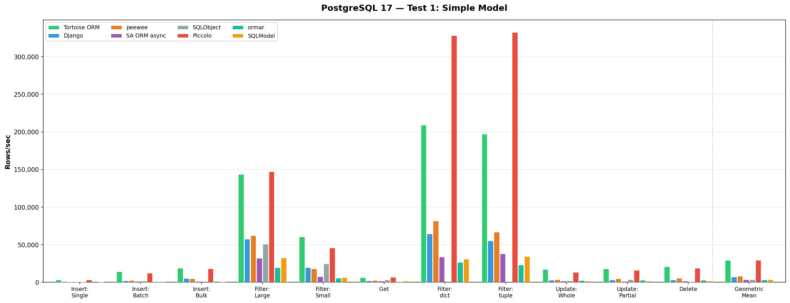

| Operation | Django | peewee | SA ORM async | SQLObject | Tortoise ORM | Piccolo | ormar | Best |
|-----------|--------|--------|--------------|-----------|--------------|---------|-------|------|
| Insert: Single | 816 | 906 | 627 | 781 | **3,515** | 3,061 | 2,145 | Tortoise ORM |
| Insert: Batch | 2,339 | 2,467 | 1,366 | 1,769 | 11,868 | **13,461** | 5,549 | Piccolo |
| Insert: Bulk | 4,018 | 5,769 | 1,250 | — | 17,964 | **21,263** | 12,192 | Piccolo |
| Filter: Large | 67,326 | 66,039 | 36,810 | 47,520 | 151,898 | **186,704** | 37,025 | Piccolo |
| Filter: Small | 18,792 | 16,631 | 6,452 | 30,075 | 59,874 | **64,848** | 19,258 | Piccolo |
| Get | 2,469 | 3,097 | 2,183 | 3,060 | 7,250 | **7,419** | 3,131 | Piccolo |
| Filter: dict | 68,298 | 90,484 | 36,678 | — | 211,837 | **345,665** | 123,759 | Piccolo |
| Filter: tuple | 70,459 | 71,977 | 39,080 | — | 194,616 | **353,066** | 125,734 | Piccolo |
| Update: Whole | 3,022 | 3,719 | 2,087 | 2,441 | 15,360 | **17,455** | 6,137 | Piccolo |
| Update: Partial | 3,941 | 5,290 | 2,132 | 4,749 | **21,749** | 19,105 | 7,941 | Tortoise ORM |
| Delete | 4,337 | 6,199 | 2,260 | 849 | **23,019** | 21,613 | 11,255 | Tortoise ORM |
| **Geometric Mean** | 7,738 | 9,086 | 4,242 | 3,952 | 29,667 | **33,957** | 13,523 | **Piccolo** |

### Test 2: FK Relations

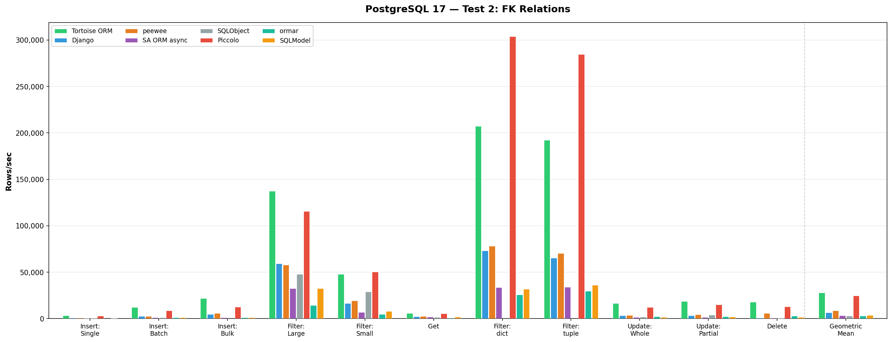

| Operation | Django | peewee | SA ORM async | SQLObject | Tortoise ORM | Piccolo | ormar | Best |
|-----------|--------|--------|--------------|-----------|--------------|---------|-------|------|
| Insert: Single | 772 | 826 | 584 | 706 | 3,229 | **3,389** | 2,265 | Piccolo |
| Insert: Batch | 2,479 | 2,576 | 1,376 | 1,795 | **14,793** | 10,769 | 4,789 | Tortoise ORM |
| Insert: Bulk | 3,699 | 5,404 | 1,291 | — | **26,183** | 14,360 | 10,508 | Tortoise ORM |
| Filter: Large | 62,311 | 62,149 | 35,269 | 60,167 | **162,753** | 152,727 | 27,724 | Tortoise ORM |
| Filter: Small | 13,020 | 16,678 | 9,262 | 28,099 | 51,166 | **52,531** | 17,270 | Piccolo |
| Get | 2,633 | 2,778 | 2,170 | 3,081 | **7,264** | 6,428 | 2,842 | Tortoise ORM |
| Filter: dict | 87,922 | 83,271 | 35,490 | — | 203,209 | **333,410** | 114,137 | Piccolo |
| Filter: tuple | 81,305 | 96,078 | 39,526 | — | 191,570 | **293,684** | 113,691 | Piccolo |
| Update: Whole | 3,296 | 3,628 | 1,686 | 2,667 | **19,620** | 15,932 | 5,767 | Tortoise ORM |
| Update: Partial | 3,602 | 4,673 | 1,996 | 4,249 | **21,749** | 18,394 | 7,515 | Tortoise ORM |
| Delete | 1,136 | 5,800 | 1,023 | 616 | **18,788** | 16,679 | 9,437 | Tortoise ORM |
| **Geometric Mean** | 6,808 | 8,849 | 3,940 | 3,828 | **30,794** | 29,154 | 12,112 | **Tortoise ORM** |

### Test 3: Wide Model (32+ fields)

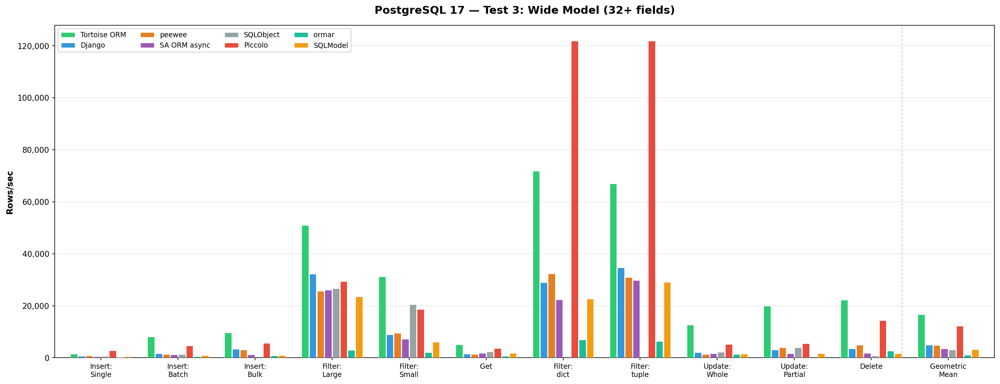

| Operation | Django | peewee | SA ORM async | SQLObject | Tortoise ORM | Piccolo | ormar | Best |
|-----------|--------|--------|--------------|-----------|--------------|---------|-------|------|
| Insert: Single | 608 | 726 | 603 | 653 | 1,322 | **2,922** | 687 | Piccolo |
| Insert: Batch | 1,288 | 1,982 | 1,303 | 1,531 | **9,211** | 6,381 | 825 | Tortoise ORM |
| Insert: Bulk | 2,706 | 3,391 | 1,315 | — | **9,736** | 7,513 | 2,601 | Tortoise ORM |
| Filter: Large | 27,289 | 23,748 | 28,734 | 34,570 | **51,671** | 44,580 | 3,680 | Tortoise ORM |
| Filter: Small | 11,492 | 10,656 | 7,485 | 22,652 | **33,227** | 25,793 | 2,991 | Tortoise ORM |
| Get | 1,693 | 1,605 | 2,003 | 2,513 | **5,781** | 4,556 | 848 | Tortoise ORM |
| Filter: dict | 36,012 | 35,023 | 27,605 | — | 76,819 | **152,664** | 8,663 | Piccolo |
| Filter: tuple | 36,148 | 38,546 | 31,831 | — | 66,046 | **137,368** | 8,653 | Piccolo |
| Update: Whole | 2,472 | 1,904 | 1,804 | 2,849 | **15,025** | 7,585 | 1,754 | Tortoise ORM |
| Update: Partial | 3,551 | 4,431 | 2,008 | 4,233 | **21,561** | 6,015 | 5,809 | Tortoise ORM |
| Delete | 4,690 | 4,770 | 2,016 | 825 | **21,578** | 19,885 | 9,054 | Tortoise ORM |
| **Geometric Mean** | 5,097 | 5,373 | 3,863 | 3,439 | **17,307** | 15,667 | 2,835 | **Tortoise ORM** |

---

## Results: MySQL 8

MySQL 8 in Docker. Driver: `asyncmy` for Tortoise, `aiomysql` for SA async / ormar, `mysqlclient` for Django, `pymysql` for peewee / SQLObject. Piccolo does not support MySQL.

### Overview

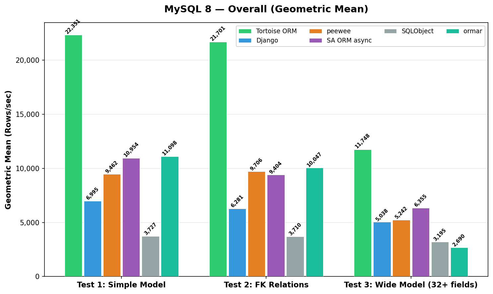

### Test 1: Simple Model (4 fields)

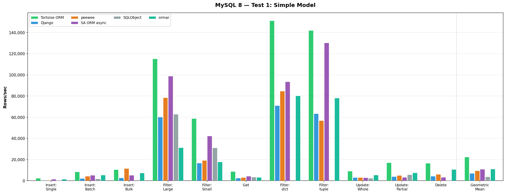

| Operation | Django | peewee | SA ORM async | SQLObject | Tortoise ORM | ormar | Best |
|-----------|--------|--------|--------------|-----------|--------------|-------|------|
| Insert: Single | 507 | 487 | 1,460 | 430 | **2,323** | 1,534 | Tortoise ORM |
| Insert: Batch | 2,242 | 4,365 | 5,216 | 1,904 | **8,466** | 5,417 | Tortoise ORM |
| Insert: Bulk | 2,811 | **11,555** | 5,224 | — | 10,610 | 7,302 | peewee |
| Filter: Large | 60,146 | 78,528 | 98,831 | 62,954 | **115,230** | 31,310 | Tortoise ORM |
| Filter: Small | 16,751 | 19,261 | 42,263 | 31,125 | **58,753** | 17,753 | Tortoise ORM |
| Get | 2,559 | 3,178 | 4,375 | 3,357 | **8,842** | 3,346 | Tortoise ORM |
| Filter: dict | 71,057 | 84,748 | 93,534 | — | **151,150** | 80,199 | Tortoise ORM |
| Filter: tuple | 63,354 | 56,855 | 130,344 | — | **142,011** | 78,117 | Tortoise ORM |
| Update: Whole | 3,038 | 3,108 | 2,906 | 2,351 | **9,163** | 5,458 | Tortoise ORM |
| Update: Partial | 4,009 | 5,085 | 3,231 | 5,695 | **17,036** | 7,582 | Tortoise ORM |
| Delete | 4,340 | 6,053 | 3,272 | 516 | **16,620** | 10,751 | Tortoise ORM |
| **Geometric Mean** | 6,995 | 9,462 | 10,954 | 3,727 | **22,351** | 11,098 | **Tortoise ORM** |

### Test 2: FK Relations

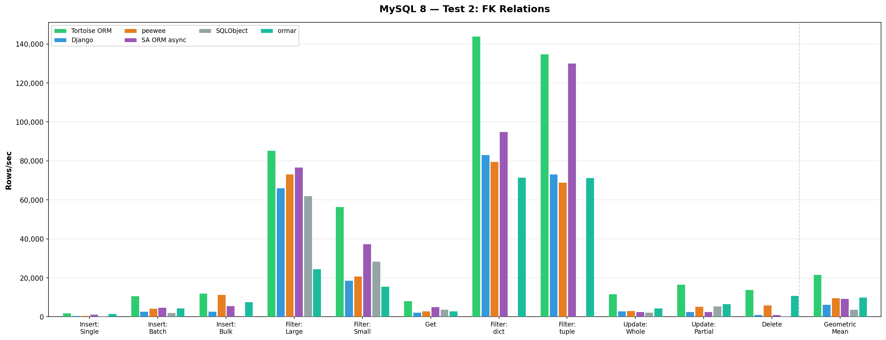

| Operation | Django | peewee | SA ORM async | SQLObject | Tortoise ORM | ormar | Best |
|-----------|--------|--------|--------------|-----------|--------------|-------|------|
| Insert: Single | 496 | 602 | 1,312 | 484 | **1,877** | 1,639 | Tortoise ORM |
| Insert: Batch | 2,796 | 4,358 | 4,760 | 2,046 | **10,641** | 4,430 | Tortoise ORM |
| Insert: Bulk | 2,834 | 11,319 | 5,721 | — | **12,074** | 7,625 | Tortoise ORM |
| Filter: Large | 66,156 | 73,257 | 76,763 | 62,048 | **85,428** | 24,484 | Tortoise ORM |
| Filter: Small | 18,585 | 20,891 | 37,485 | 28,461 | **56,558** | 15,613 | Tortoise ORM |
| Get | 2,295 | 2,998 | 5,102 | 3,841 | **8,174** | 2,950 | Tortoise ORM |
| Filter: dict | 83,183 | 79,578 | 94,927 | — | **143,941** | 71,452 | Tortoise ORM |
| Filter: tuple | 73,233 | 69,027 | 130,157 | — | **134,813** | 71,394 | Tortoise ORM |
| Update: Whole | 2,994 | 3,028 | 2,559 | 2,330 | **11,729** | 4,509 | Tortoise ORM |
| Update: Partial | 2,550 | 5,266 | 2,680 | 5,527 | **16,633** | 6,735 | Tortoise ORM |
| Delete | 1,164 | 6,035 | 1,144 | 416 | **13,942** | 10,886 | Tortoise ORM |
| **Geometric Mean** | 6,281 | 9,706 | 9,404 | 3,710 | **21,701** | 10,047 | **Tortoise ORM** |

### Test 3: Wide Model (32+ fields)

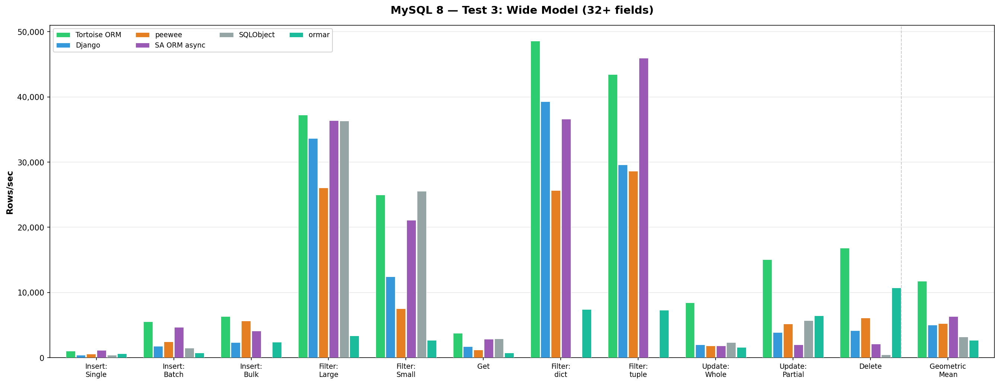

| Operation | Django | peewee | SA ORM async | SQLObject | Tortoise ORM | ormar | Best |
|-----------|--------|--------|--------------|-----------|--------------|-------|------|
| Insert: Single | 442 | 565 | **1,183** | 408 | 1,046 | 647 | SA ORM async |
| Insert: Batch | 1,795 | 2,499 | 4,712 | 1,521 | **5,575** | 793 | Tortoise ORM |
| Insert: Bulk | 2,386 | 5,658 | 4,124 | — | **6,352** | 2,400 | Tortoise ORM |
| Filter: Large | 33,634 | 26,069 | 36,388 | 36,334 | **37,230** | 3,378 | Tortoise ORM |
| Filter: Small | 12,420 | 7,542 | 21,135 | **25,564** | 24,999 | 2,705 | SQLObject |
| Get | 1,745 | 1,213 | 2,867 | 2,903 | **3,766** | 781 | Tortoise ORM |
| Filter: dict | 39,306 | 25,669 | 36,619 | — | **48,560** | 7,437 | Tortoise ORM |
| Filter: tuple | 29,581 | 28,607 | **45,935** | — | 43,471 | 7,346 | SA ORM async |
| Update: Whole | 2,013 | 1,850 | 1,861 | 2,345 | **8,471** | 1,607 | Tortoise ORM |
| Update: Partial | 3,900 | 5,204 | 2,021 | 5,728 | **15,071** | 6,467 | Tortoise ORM |
| Delete | 4,206 | 6,094 | 2,128 | 483 | **16,824** | 10,725 | Tortoise ORM |
| **Geometric Mean** | 5,038 | 5,242 | 6,355 | 3,195 | **11,748** | 2,690 | **Tortoise ORM** |

---

## Results: SQLite

SQLite on local filesystem (`/tmp/db.sqlite3`). This benchmark is inherently single-threaded due to SQLite's write lock — async ORMs pay overhead without concurrency benefit.

### Overview

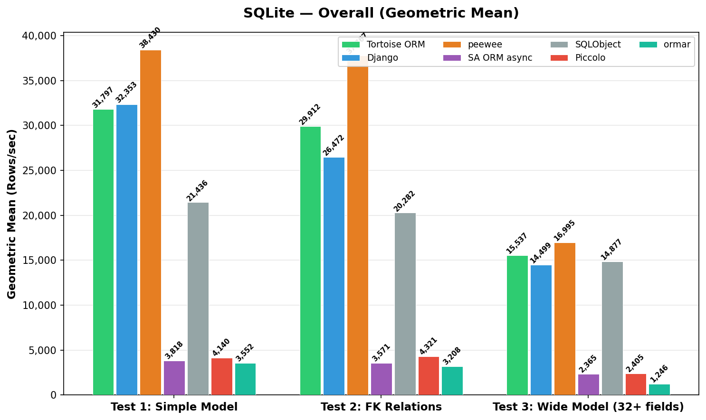

### Test 1: Simple Model (4 fields)

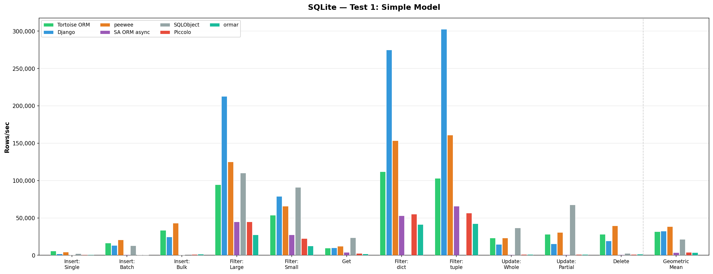

| Operation | Django | peewee | SA ORM async | SQLObject | Tortoise ORM | Piccolo | ormar | Best |
|-----------|--------|--------|--------------|-----------|--------------|---------|-------|------|
| Insert: Single | 2,004 | 4,279 | 607 | 2,330 | **5,662** | 757 | 866 | Tortoise ORM |
| Insert: Batch | 13,184 | **20,643** | 783 | 12,969 | 16,565 | 667 | 475 | peewee |
| Insert: Bulk | 24,777 | **43,200** | 634 | — | 33,600 | 1,040 | 1,423 | peewee |
| Filter: Large | **212,840** | 125,234 | 44,999 | 110,217 | 94,461 | 44,845 | 27,453 | Django |
| Filter: Small | 78,914 | 65,955 | 27,530 | **90,926** | 53,668 | 22,419 | 12,498 | SQLObject |
| Get | 10,186 | 12,220 | 3,885 | **23,711** | 9,883 | 2,516 | 1,778 | SQLObject |
| Filter: dict | **274,904** | 153,428 | 53,112 | — | 112,070 | 55,001 | 41,392 | Django |
| Filter: tuple | **302,445** | 160,806 | 65,703 | — | 103,063 | 56,621 | 42,246 | Django |
| Update: Whole | 14,554 | 23,272 | 803 | **36,662** | 23,159 | 1,132 | 1,130 | SQLObject |
| Update: Partial | 15,580 | 30,761 | 777 | **67,427** | 28,166 | 1,151 | 1,111 | SQLObject |
| Delete | 19,253 | **39,689** | 797 | 2,512 | 28,241 | 1,133 | 1,446 | peewee |
| **Geometric Mean** | 32,353 | **38,430** | 3,818 | 21,436 | 31,797 | 4,140 | 3,552 | **peewee** |

### Test 2: FK Relations

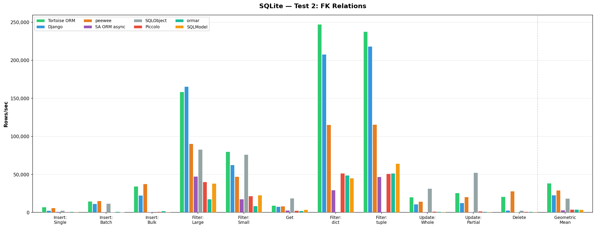

| Operation | Django | peewee | SA ORM async | SQLObject | Tortoise ORM | Piccolo | ormar | Best |
|-----------|--------|--------|--------------|-----------|--------------|---------|-------|------|
| Insert: Single | 2,374 | 4,997 | 828 | 2,335 | **5,482** | 902 | 756 | Tortoise ORM |
| Insert: Batch | 9,760 | **17,248** | 635 | 12,835 | 14,343 | 790 | 455 | peewee |
| Insert: Bulk | 25,158 | **50,766** | 790 | — | 33,773 | 1,009 | 1,360 | peewee |
| Filter: Large | **210,125** | 117,059 | 43,287 | 107,932 | 92,058 | 41,432 | 20,261 | Django |
| Filter: Small | 73,391 | 59,969 | 23,385 | **89,637** | 52,786 | 21,905 | 12,331 | SQLObject |
| Get | 9,994 | 11,077 | 3,609 | **23,065** | 9,537 | 2,508 | 1,606 | SQLObject |
| Filter: dict | **260,618** | 155,456 | 50,541 | — | 107,933 | 64,781 | 36,184 | Django |
| Filter: tuple | **290,270** | 149,409 | 58,925 | — | 108,155 | 50,421 | 37,927 | Django |
| Update: Whole | 13,295 | 21,252 | 795 | **34,036** | 23,143 | 1,123 | 1,139 | SQLObject |
| Update: Partial | 15,653 | 32,229 | 797 | **56,089** | 25,892 | 1,421 | 1,111 | SQLObject |
| Delete | 3,163 | **41,192** | 420 | 2,243 | 19,922 | 1,148 | 1,136 | peewee |
| **Geometric Mean** | 26,472 | **37,767** | 3,571 | 20,282 | 29,912 | 4,321 | 3,208 | **peewee** |

### Test 3: Wide Model (32+ fields)

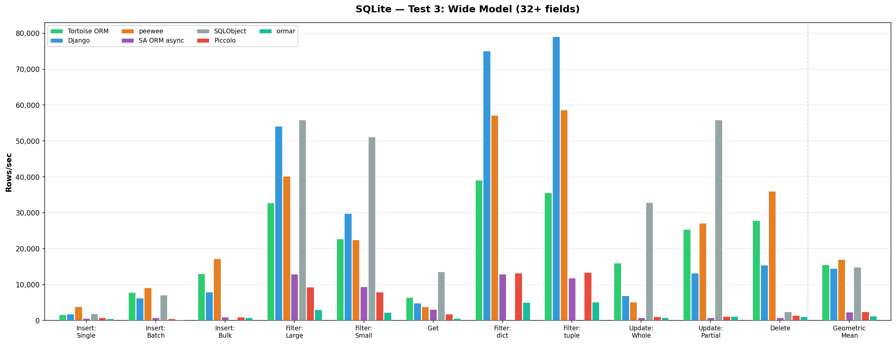

| Operation | Django | peewee | SA ORM async | SQLObject | Tortoise ORM | Piccolo | ormar | Best |
|-----------|--------|--------|--------------|-----------|--------------|---------|-------|------|
| Insert: Single | 1,831 | **3,799** | 607 | 1,925 | 1,659 | 803 | 543 | peewee |
| Insert: Batch | 6,209 | **9,137** | 749 | 7,121 | 7,832 | 475 | 255 | peewee |
| Insert: Bulk | 7,966 | **17,209** | 997 | — | 13,000 | 971 | 797 | peewee |
| Filter: Large | 54,081 | 40,191 | 12,930 | **55,882** | 32,760 | 9,301 | 2,980 | SQLObject |
| Filter: Small | 29,765 | 22,464 | 9,414 | **51,133** | 22,795 | 7,929 | 2,276 | SQLObject |
| Get | 4,863 | 3,796 | 3,094 | **13,606** | 6,396 | 1,788 | 638 | SQLObject |
| Filter: dict | **75,037** | 57,152 | 12,965 | — | 39,130 | 13,243 | 5,011 | Django |
| Filter: tuple | **79,026** | 58,694 | 11,859 | — | 35,598 | 13,404 | 5,098 | Django |
| Update: Whole | 6,938 | 5,101 | 812 | **32,917** | 16,013 | 1,096 | 760 | SQLObject |
| Update: Partial | 13,230 | 27,090 | 779 | **55,879** | 25,372 | 1,120 | 1,107 | SQLObject |
| Delete | 15,433 | **35,992** | 780 | 2,449 | 27,884 | 1,463 | 1,097 | peewee |
| **Geometric Mean** | 14,499 | **16,995** | 2,365 | 14,877 | 15,537 | 2,405 | 1,246 | **peewee** |

---

## Analysis

### PostgreSQL — Async ORMs dominate

Tortoise ORM and Piccolo share the top spots. Both use `asyncpg`, which provides binary protocol encoding and connection pooling — a massive advantage over `psycopg2`-based sync ORMs. Piccolo leads on simple reads (Filter: dict/tuple) thanks to its ultra-thin result mapping layer, while Tortoise excels at writes (Insert, Update, Delete) and wins overall on the more complex Test 2 and Test 3 schemas.

### MySQL — Tortoise ORM leads decisively

Tortoise ORM wins every test by a wide margin (2x over the runner-up). The `asyncmy` driver (native async MySQL protocol) outperforms both `aiomysql` and sync `mysqlclient`/`pymysql`. SA ORM async is competitive on reads but falls behind on writes. Piccolo does not support MySQL.

### SQLite — Sync ORMs are faster

On SQLite, async overhead hurts more than it helps — there is no concurrency to exploit due to SQLite's single-writer lock. Sync ORMs (peewee, Django, SQLObject) avoid the `aiosqlite` polling overhead and win handily. peewee takes the overall crown, with Django dominating large filter operations and SQLObject excelling at single-row operations (Get, Update). Tortoise ORM remains the fastest async ORM on SQLite.

### Key takeaways

- **For PostgreSQL/MySQL production workloads**: Tortoise ORM and Piccolo (PG only) offer the best throughput
- **For SQLite/local development**: peewee and Django are faster due to lower async overhead
- **SA ORM async**: Strong on reads but consistently slow on writes due to Session/UoW overhead
- **ormar**: Pydantic validation overhead causes significant slowdown, especially on wide models (Test 3)
- **SQLObject**: Missing bulk insert and dict/tuple filter operations, but surprisingly fast on single-row SQLite operations

## Running the benchmarks

```sh
# Clone and install
git clone https://github.com/tortoise/orm-benchmarks.git
cd orm-benchmarks
uv venv && source .venv/bin/activate
uv pip install -e .

# SQLite (default)
cd benchmarks && sh bench.sh

# PostgreSQL
export DBTYPE=postgres PASSWORD=yourpassword PGPORT=5432
cd benchmarks && sh bench.sh

# MySQL
export DBTYPE=mysql PASSWORD=yourpassword MYPORT=3306
cd benchmarks && sh bench.sh
```
